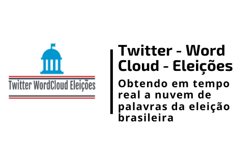

<h1 align="center">
    
</h1>

<h4 align="center"> 
	🚧 TWITTER - WORD CLOUD - ELEIÇÃO 1.0 🚀 em desenvolvimento... 🚧
</h4>

<p align="center">
  

  

  	
  <a href="https://www.linkedin.com/in/emerson-rafael/">
    
  </a>
	
  
  <a href="https://github.com/emersonrafaels/twitter_word_cloud_eleicao/commits/main">
    
  </a>

  
   <a href="https://github.com/emersonrafaels/twitter_word_cloud_eleicao/stargazers">
    
  </a>
</p>


## 💻 Sobre o projeto

📦 **TWITTER - WORD CLOUD - ELEIÇÃO** é um projeto de **processamento de linguagem natural (NLP)** que utiliza a **API do Twitter** para obter os **tweets** sobre a **Eleição brasileira**.

O projeto contém:

1. **API do Twitter** (fornecendo um *Wrapper*) permitindo a *execução de uma query*, definindo-se:
	1. Palavras chaves buscadas (query)
	2. Start time (start_time)
	3. End time (end_time)
	4. Quantidade de tweets desejados (limit_tweets)
2.  **Armazenamento** das palavras chaves em um **banco de dados MongoDB**
3. Criação do **WordCloud** após aplicação de técnicas de limpeza de dados.
	1. Tokenização
	2. Remoção de StopWords
	3. Remoção de pontuações
	4. Lematização

## ✍️  Técnicas utilizadas

 - **Tokenização** - É o processo de segmentar o texto em _tokens_, que são as formas mais elementais (geralmente palavras e pontuação) que carregam significado. O processo de tokenização deve levar em consideração detalhes como, por exemplo, se determinada pontuação indica ou não separação de tokens. Por exemplo, na frase _“Vou viajar pra N.Y.”_, o segmento _N.Y._ indica a entidade _Nova York_, e deve ser considerado um único token. Os modelos disponíveis no spaCy permitem essa tokenização especializada, produzindo resultados altamente adequados para as tarefas seguintes.
 - **Lematização** - Esse processo reduz as flexões das palavras ao seu _lemma_ ou raiz. Por exemplo, a palavra no plural _aviões_ é derivada do lemma _avião,_ assim como o verbo _assistimos_ tem origem no lemma _assistir._ A lemmatização costuma simplificar e generalizar os resultados de algumas tarefas de PLN posteriores.
 - **Remoção das Stop Words** - As stop words são atualmente as palavras mais comuns em uma língua (como artigos, preposições, pronomes, conjunções, etc) e não trazem informações úteis ao texto. Exemplos de stopwords são: 'de', 'do', 'e', 'então'.
 - **Remoção de pontuações** - Para contar a frequência de palavras é útil remover as pontuações, evitando que elas sejam consideradas palavras.

## 🛠  Tecnologias

As seguintes ferramentas foram usadas na construção do projeto:

- [Python]

## 💖  Bibliotecas auxiliares

Libs interessantes utilizadas no Projeto:

- [Tabulate](https://pypi.org/project/tabulate/): Permitindo obter preety prints de dados tabulados.

## ♤♠♧♣  Passos

 - Criar arquivo: CONFIG/.secrets.toml
 - Inserindo os dados de configuração no .secrets.toml
```python 
[default]

[premium]
SEARCHTWEETS_BEARER_TOKEN = "VALUE_BEARER_TOKEN"
SEARCHTWEETS_CONSUMER_KEY = "VALUE_CONSUMER_KEY"
SEARCHTWEETS_CONSUMER_SECRET = "VALUE_CONSUMER_SECRET"
SEARCHTWEETS_ACCESS_TOKEN = "VALUE_ACCESS_TOKEN"
SEARCHTWEETS_ACCESS_TOKEN_SECRET = "VALUE_ACCESS_TOKEN_SECRET"

[enterprise]
```

## 🚀 Como executar o projeto

1. **Instalando**: pip install -r requirements.txt

## ➊ Pré-requisitos

- Antes de começar, você vai precisar ter instalado em sua máquina as seguintes ferramentas (O download pode ser realizado pela própria página do Python ou Anaconda):
[Python](https://www.anaconda.com/products/individual).

- Irá ser necessário obter os tokens de acesso à API do Twitter usando a sequência de passos listadas em: https://developer.twitter.com/en/docs/platform-overview.

## 📝 Licença

Este projeto está sob a licença MIT.

Feito com ❤️ por **Emerson Rafael** 👋🏽 [Entre em contato!](https://www.linkedin.com/in/emerson-rafael/)

[Python]: https://www.python.org/downloads/